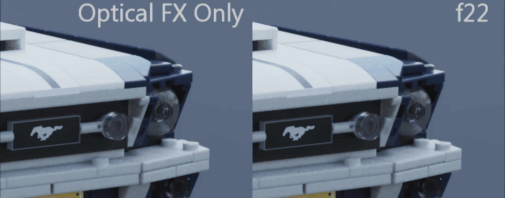

# Nuke-Public-Tools
My freely available scripts and tools for Nuke

Jump to Documentation:

[LensFX_GQ](https://github.com/gquelch/Nuke-Public-Gizmos#lensfx_gq)

[LightWrap_GQ](https://github.com/gquelch/Nuke-Public-Gizmos#lightwrap_gq)

[ColourChecker_GQ](https://github.com/gquelch/Nuke-Public-Gizmos#colourchecker_gq)

---

## LensFX_GQ
This is my all one tool for DOF, it is able to bring together PGBokeh, OpticalZDefocus and ZDefocus into one tool with shared, real world lens controls. This allows you to swap between different tools on the fly. The tool uses digital "Lens Sets" which allow you to customise focal lengths and optical qualities like chromatic aberration and blur, all of which are tied to the aperture of the lens, the wider you open the lens, the stronger the effects.

ZDefocus is included by default, but does not support physical lens simulation, you are able to customise the min and max blur of each lens using the lens set, and the aperture slider will blend between these values. pgBokeh and Optical Z Defocus both support real world simulation, and the strength of the blur is driven solely by the Aperture and sensor size values.

### Lens Sets

The gizmo makes use of "Lens Sets" this is to emulate having a limited set of lenses as you would on a Live Action shoot, each with their own unique qualities. Each lens can be customised with:

- Focal Length
- Glow
- DOF Strength (only applicable for zDefocus, OpticalZDefocus and PGBokeh will use real world simulation)
- Chromatic Aberration
- Aperture Blades

You can have any number of lenses in a set, and each can be totally customised, this gives them all a slightly different feel, there is an example .json file provided on Github, which you can use as a starting point. **You must have one loaded into the "Lens Data Path" in "Advanced" for the tool to function.**

The optical qualities, currently chromatic aberration and glow, are tied to the aperture value, like a real lens, these are stronger when the aperture is open wider, see the comparison below for an example.

### Adding 3rd Party Tools

In order to add [OpticalZDefocus](https://gist.github.com/jedypod/50a3b68f9b5bbe487e1a) or [PGBokeh](https://peregrinelabs.com/bokeh/) you need to have one present in the node graph for LensFX to pick up, after that you simply need to press the appropriate button in the "Advanced tab" and the node will be integrated, and should be available in the "Pick Focus Tool" menu.

Once you have done this you can save the file and use it freely and add it to your pipeline.

### Master + Child

Group nodes in Nuke can't be cloned but sometimes you need multiple DOF nodes, so I included a "Set Master" function. Pressing the button will make the current node the scripts master, it will turn blue, all other LensFX nodes in the script will become children, and their controls will be locked and get their values from the master. 

If you want to break this connection, you simply hit the "Set Master" button again, which will clear all children. If you press this button on a child node, it will become the new master.

  

## LightWrap_GQ

This is my own custom light wrap node, I find the default node frustrating as if often messes with other channels if used directly in the main pipe. My node only affects the RGB channels so you no longer have to worry about that.

There are also two types of blur, a standard soft gausian, and an exponential blur, this allows you to get a really nice falloff in the light wrap, as well as the softer colour bleed you can get with the standard lightwrap node  

  

## ColourChecker_GQ

I designed this tool to be able to better make use of macbeth charts for VFX projects.

The idea was having a more stremlined way of compare your Render and Reference colour checkers, being able to view either one on top of the other, so you can closely match up the colours.

Correct digital MacBeth charts can be found [here](http://www.nukepedia.com/gizmos/draw/x-rite-colorchecker-classic-2005-gretagmacbeth) in many colourspace's, as EXR download or Nuke Gzimo.

You'll want to move the 4 controls in Reference and Render dropdowns to the corners of your Reference and Render colour checkers, then you have 3 options (Merged, Ref / Render, Render / Ref)

With this workflow you can simply copy the grade nodes over to your CG elements and use them as a starting point for the grade.

I have written up a detailed workflow guide for this process, which you can find [here](https://gquelch.github.io/2020/05/14/Colour-Checker-Nuke-Workflow-d6e754f150584b09ba230bf43706539d/)
